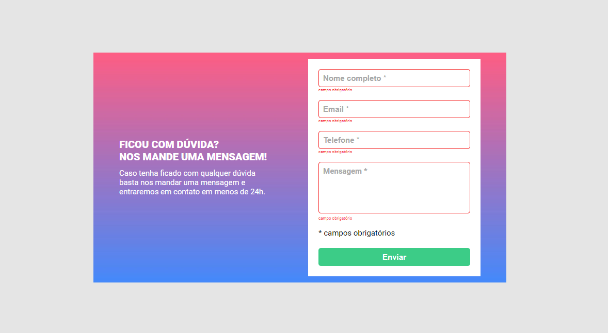
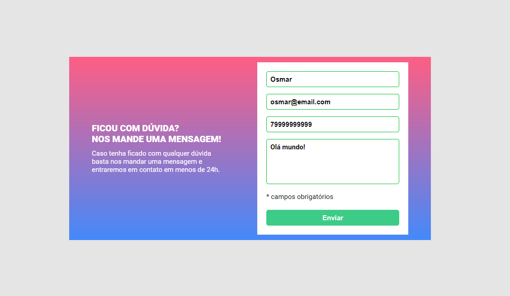
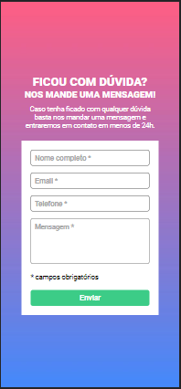

# Projeto do Desafio Dev Quest - HTML + CSS + JS 🟠🔵🟡

## Formulário com validação no JavaScript

### Projeto criado para o Desafio Dev Quest do curso Dev em Dobro.

#

### Versão desktop

[]

#

### Versão desktop active error states

[]

#

### Versão desktop active success states

[]

#

### Versão mobile

[]

#

## Tecnologias utilizadas:

- HTML
- CSS
- JavaScript

## Principais desafios:

- Pensar na lógica da programação;
- Criar o código que atendesse às solicitações;
- Estudar maneiras mais assertivas de validação dos inputs(nome, email e telefone).

## Bônus:

- Inclusão de versão mobile;
- inclusão de validação com envio de alerta quando todos os campos são preenchidos corretamente;
- inclusão de validações mais 'completas para alguns campos.

#

Create by Osmar Viana©
